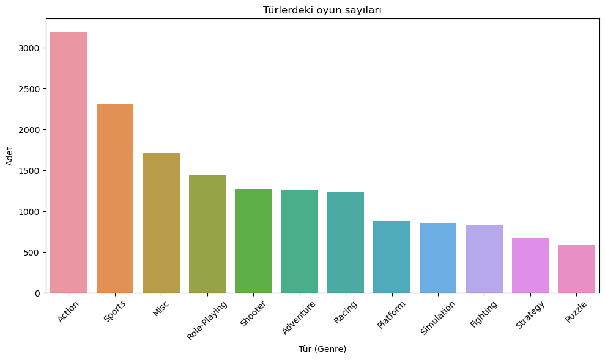
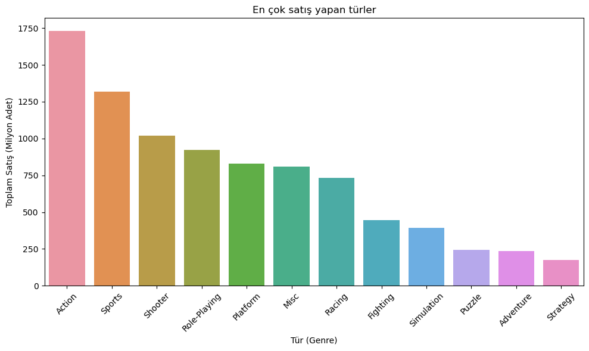
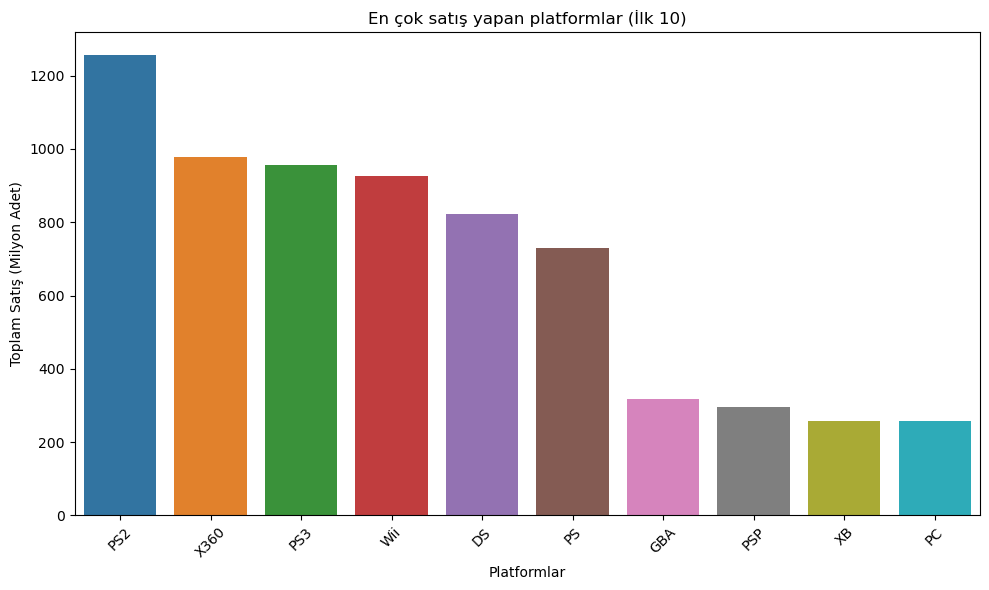
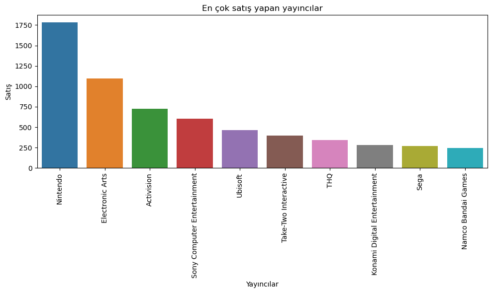
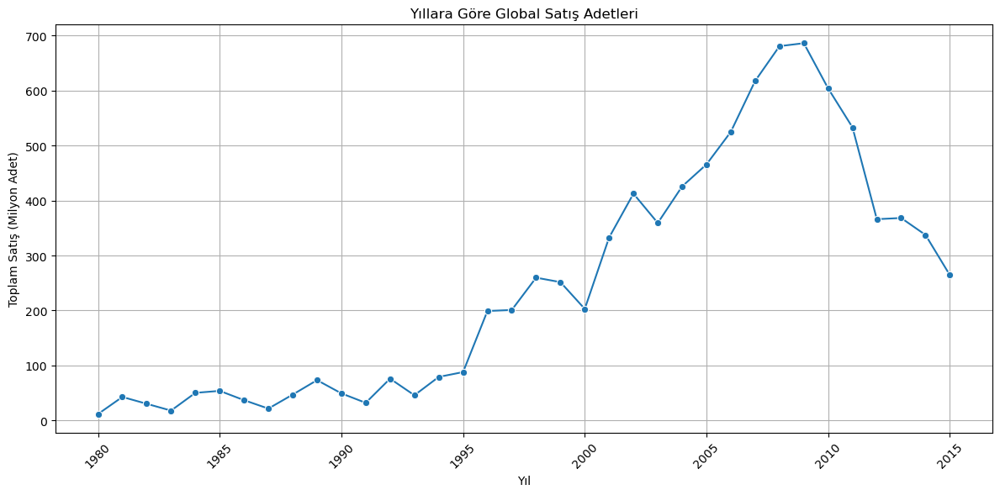
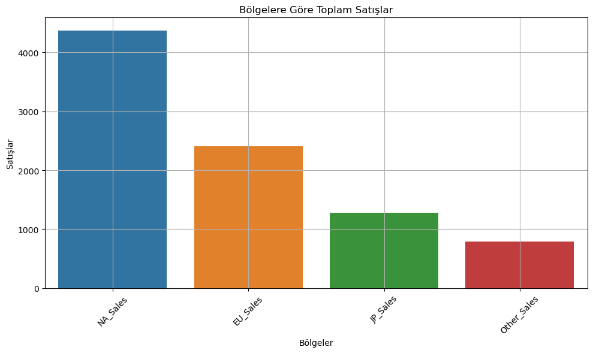
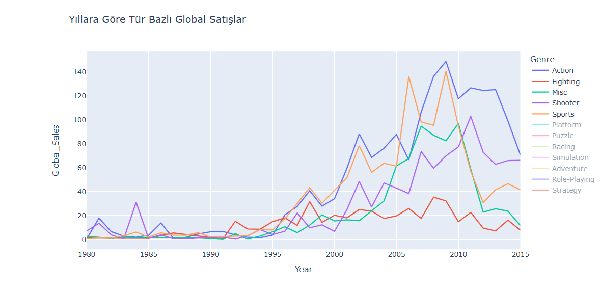
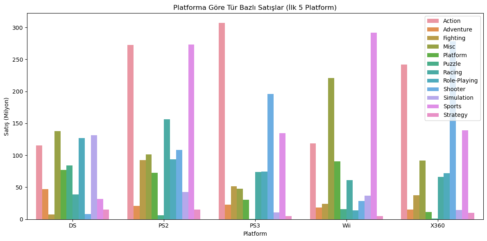

https://media1.giphy.com/media/v1.Y2lkPTc5MGI3NjExbjQzOXg4YWJzeG95ajc2dHkzZ2ZoZ3ZzZzlqbjhlaTlpYW9pOW41YiZlcD12MV9pbnRlcm5hbF9naWZfYnlfaWQmY3Q9Zw/63JsfhYYLq0VOEgkpE/giphy.gif

# 🎮 Video Game Sales Analysis

Bu proje, **Kaggle** üzerinden alınan [Video Game Sales](https://www.kaggle.com/datasets/gregorut/videogamesales) veri seti kullanılarak, global çapta video oyunlarının satış performanslarını incelemektedir. Proje kapsamında veri temizleme, görselleştirme ve trend analizi gibi temel veri bilimi adımları uygulanmıştır.

## 🔍 Kullanılan Veri Seti

- **Kaynak:** Kaggle - Video Game Sales
- **Boyut:** 16.598 satır, 11 sütun
- **Öne çıkan sütunlar:**
  - `Name`: Oyun adı
  - `Platform`: Yayınlandığı platform
  - `Year`: Yayın yılı
  - `Genre`: Tür
  - `Publisher`: Yayıncı
  - `Global_Sales`, `NA_Sales`, `EU_Sales`, `JP_Sales`, `Other_Sales`: Bölgesel satışlar (milyon adet)

## 🛠️ Kullanılan Araçlar ve Kütüphaneler

- Python
- Pandas, NumPy
- Matplotlib, Seaborn
- Plotly Express

## 📈 Gerçekleştirilen Analizler

### 🎮 Türlerdeki Oyun Sayıları



### 💰 En Çok Satış Yapan Türler



### 🕹️ En Çok Satış Yapan Platformlar



### 🏢 En Çok Satış Yapan Yayıncılar



### 📊 Yıllara Göre Global Satışlar



### 🌍 Bölgelere Göre Toplam Satışlar



### 🌐 Türlere Göre Bölgesel Dağılım


### 📉 Yıllara Göre Tür Bazlı Satış Trendleri



### 🧩 Platforma Göre Tür Dağılımı



## 📌 Dosya Yapısı

```
├── vgsales.csv                 # Ham veri
├── videoGameSales.ipynb             # Veri analizi notebook'u
├── README.md                  # Proje açıklaması (bu dosya)
├── grafikler/01.png ~ 09.png            # Görseller
```
